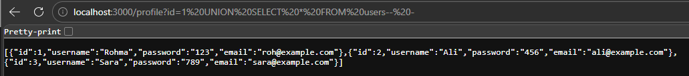

# ATTACK REPORT
### Vulnerability Name: 
SQL Injection — EXTRACTING DATA
### Severity: 
Critical
### Location: 
week2\index.js
line:47
### LIGIT SQL Query:
FINAL QUERY: SELECT * FROM users WHERE id=1'
### What I Did:
UNION is a command which simply combine two queries. I completed the original query and then using union write another query according to columns which extract the data.
### Malicious Payload:
/profile?id=1 UNION SELECT * FROM users-- -
### Resulting SQL Query:
FINAL QUERY: SELECT * FROM users WHERE id = 1 UNION SELECT * FROM users-- -
### Impact:
When SQL injection is done using the UNION operator through a URL parameter, the impact can be especially dangerous because it allows attackers to combine the results of their malicious query with the legitimate query. By altering the URL, they can append something like UNION SELECT ... to the original statement. This means they can trick the database into returning extra rows that contain sensitive information from other tables, such as usernames, emails, or even hashed passwords. Since UNION merges datasets, attackers can pull data from tables that the application was never intended to expose. The consequences include unauthorized data disclosure, leakage of confidential records, and potentially gaining insights into the database structure itself. This type of attack not only compromises privacy but can also be used as a stepping stone for deeper exploitation, leading to full system compromise and reputational damage for the organization.
### Screenshot Evidence:

### Recommended Fix: 
const query = "SELECT * FROM users WHERE id = ?";
Parameterized queries work by separating SQL code from user input, which is why they are so secure. Instead of directly inserting user data into the SQL statement, placeholders like ? are used in the query, and the actual values are sent separately. The database first prepares the query as a fixed template and treats all input values strictly as data, not as SQL commands. This prevents any malicious input from being executed as part of the query, because quotes, special characters, or logical statements are interpreted as plain text. In short, parameterized queries work by enforcing a clear boundary between code and data, making SQL injection attacks impossible and ensuring that user inputs can only affect the values, never the query structure.