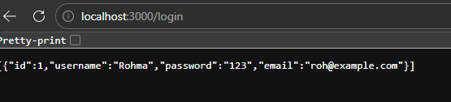

# ATTACK REPORT
### Vulnerability Name: 
SQL Injection — Login Bypas
### Severity: 
Critical
### Location: 
week2\index.js
line:25
### LIGIT SQL Query:
FINAL QUERY: SELECT * FROM users WHERE username ='Rohma' AND password = '123'
### What I Did:
At the feild of username if we enter the correct username and comment out the rest of the query we can enter in without password. If we enter (' OR '1'='1'-- -) it will make the query true which returs all the rows in data base and attaker is login as the first user in data base.
### Malicious Payload:
username:Rohma'-- -
password:anything
### Resulting SQL Query:
FINAL QUERY: SELECT * FROM users WHERE username ='Rohma'-- -' AND password = 'eeeeeeee'
### Impact:
If the attacker lands on a regular user account, they gain full access to that person's private data including personal details, messages, order history, and any saved payment information. They can act entirely on behalf of that user, making purchases, changing account details, or locking the real owner out by changing the password. For the victim, this feels identical to having their account fully stolen.
The far more dangerous scenario is landing on an admin account. With admin access, the attacker now controls the entire application. They can view, edit, or delete any user's data across the whole platform. They can create new admin accounts for persistent backdoor access even after the vulnerability is patched. They can disable security settings, manipulate financial records, issue refunds to themselves, or completely wipe the database, bringing the entire service down.
### Screenshot Evidence:

### Recommended Fix: 
const query = "SELECT * FROM users WHERE username = ? AND password = ?";
Parameterized queries work by separating SQL code from user input, which is why they are so secure. Instead of directly inserting user data into the SQL statement, placeholders like ? are used in the query, and the actual values are sent separately. The database first prepares the query as a fixed template and treats all input values strictly as data, not as SQL commands. This prevents any malicious input from being executed as part of the query, because quotes, special characters, or logical statements are interpreted as plain text. In short, parameterized queries work by enforcing a clear boundary between code and data, making SQL injection attacks impossible and ensuring that user inputs can only affect the values, never the query structure.